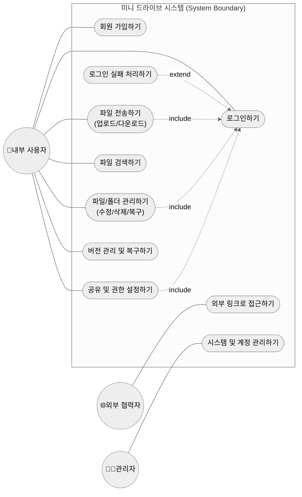
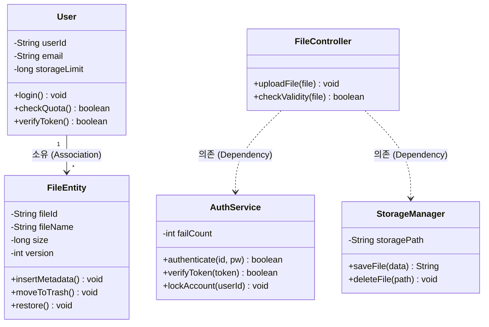
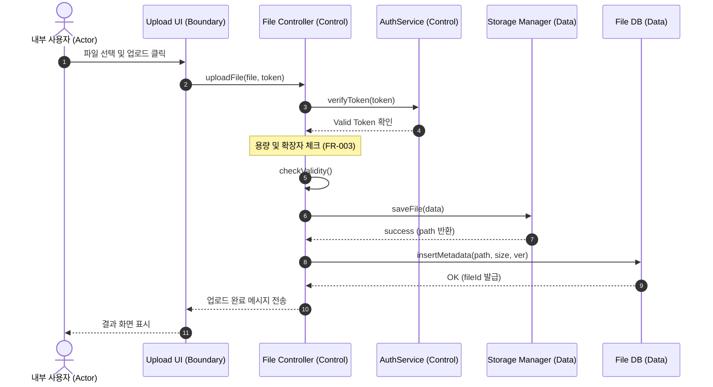
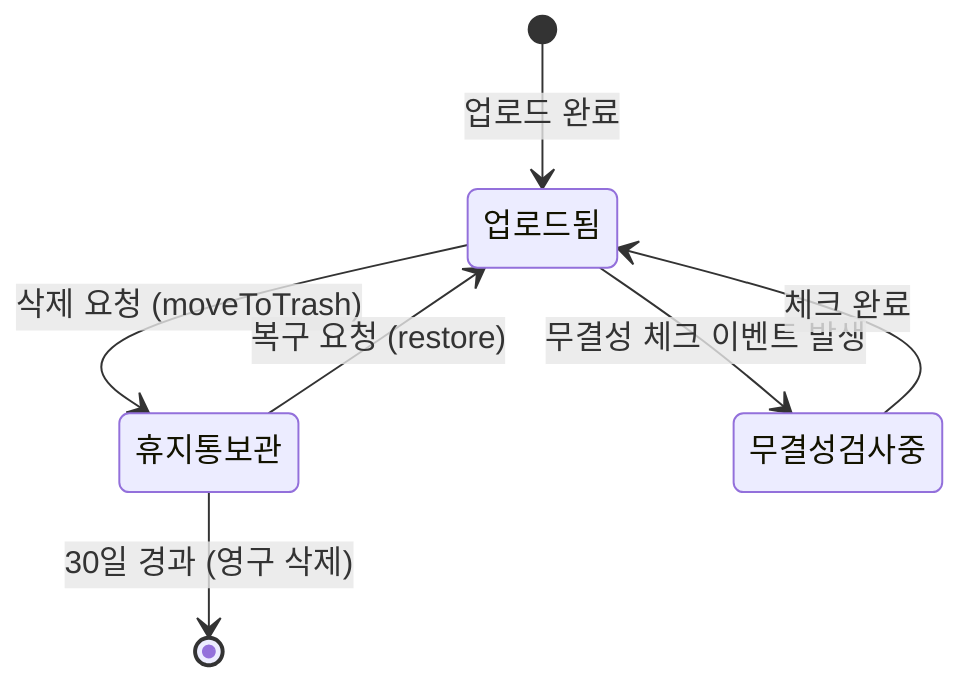

## 1. 서론

### 1.1 목적 및 범위

본 문서는 조직 내 파일의 중앙 관리 및 협업을 지원하기 위한 '미니 드라이브' 시스템의 요구사항을 분석한 결과입니다. 시스템이 수행해야 할 기능, 구조적 요소, 동적 행위를 UML 다이어그램을 통해 정의합니다.

### 1.2 용어 정의

* **RBAC**: 역할 기반 접근 제어 (Role-Based Access Control).

* **CRC 카드**: 클래스-책임-협업자 카드 (Class-Responsibility-Collaboration Card).

---

## 2. 기능 모델링 (Functional Modeling)

### 2.1 유스케이스 다이어그램

사용자 관점에서 시스템의 기능을 식별하여 도식화하였습니다. 직관적인 이해를 돕기 위해 유스케이스를 8개의 주요 그룹으로 구성하였습니다.

* **액터 식별**: 역할을 중심으로 내부 사용자, 외부 협력자, 관리자를 식별하였습니다.

* **포함 관계**: 파일 전송, 파일 관리 및 공유 기능은 사용자 인증이 필요하므로 로그인하기 유스케이스와 `<<include>>` 관계를 설정하였습니다.

### 2.2 유스케이스 설명서: 파일 업로드하기

유스케이스의 식별 정보와 상세 흐름을 나타냅니다.

| 항목 | 상세 내용 |
|---|---|
| **ID / 이름** | UC-002 / 파일 업로드하기 (File Upload) |
| **주요 액터** | 내부 사용자 |
| **사전 조건 (Precondition)** | 사용자는 로그인된 상태여야 하며 업로드 권한을 가지고 있어야 한다. |
| **정상 시나리오** | 1. 사용자는 업로드할 파일을 선택하고 전송 버튼을 클릭한다. 2. 시스템은 로그인 세션 및 접근 권한을 확인한다. 3. 시스템은 잔여 저장 용량을 검사한다. 4. 시스템은 파일 확장자와 크기를 검사한다. 5. 시스템은 파일을 저장하고 메타데이터를 DB에 기록한다. 6. 시스템은 업로드 완료 메시지를 출력한다. |
| **예외 처리** | • 용량 부족 시: 저장 공간 부족 메시지를 출력하고 업로드를 중단한다. • 차단 확장자 발견 시: 업로드 불가 파일 형식 메시지를 출력한다. |                                                                                                 |

---

## 3. 구조 모델링 (Structural Modeling)

### 3.1 클래스 다이어그램

업무 수행 과정에서 필요한 주요 도메인 객체를 중심으로 식별하고 관계를 정의하였으며, 시스템 흐름 표현을 위해 일부 제어 객체를 함께 포함하였습니다. 문장 분석법을 통해 명사는 클래스로, 동사는 연산으로 매핑하였습니다.

* **가시성**: 속성은 `-` (Private), 연산은 `+` (Public)로 구분하였습니다.

* **기수성**: 한 명의 사용자는 여러 개의 파일을 소유할 수 있으므로 `1 대 *` 관계를 설정하였습니다.

### 3.2 CRC 카드 명세 (FileEntity)

클래스의 책임과 협업 관계를 명세합니다.

* **전면부 (Front)**:

* **Class Name**: FileEntity (ID: 02, Type: Concrete)
* **Description**: 파일의 메타데이터 및 물리적 저장 상태를 관리한다.
* **Responsibilities**: 메타데이터 저장, 휴지통 이동, 버전 복구.
* **Collaborators**: User, StorageManager, AuthService.

* **후면부 (Back)**:

* **Attributes**: fileId, fileName, size, version.
* **Relationships**: User (Owned by), StorageManager (Associated).

---

## 4. 행위 모델링 (Behavioral Modeling)

### 4.1 순차 다이어그램: 파일 업로드하기

객체 간의 메시지 패싱을 시간 흐름 중심으로 나타냅니다. ABCD 규칙(Actor-Boundary-Control-Data)에 따라 객체를 나열하였습니다.

### 4.2 상태기계 다이어그램: 파일 상태

파일 객체의 생성부터 소멸까지의 상태 변화를 모델링하였습니다.

---

## 5. 산출물 간 일관성 점검 (Consistency Verification)

설계 단계로 진행하기 전 분석 모델 간의 일관성을 점검합니다.

* **기능 모델 vs 구조 모델**: 유스케이스 설명서에 명시된 `AuthService`, `User`, `FileEntity` 클래스가 클래스 다이어그램에 모두 정의되어 있습니다.

* **기능 모델 vs 행위 모델**: '파일 업로드' 유스케이스가 하나의 순차 다이어그램으로 표현되었으며, 액터 정보가 일치합니다.

* **구조 모델 vs 행위 모델**: 순차 다이어그램에서 객체 간 전달되는 메시지(`verifyToken`, `insertMetadata` 등)가 클래스 다이어그램의 연산으로 정의되어 있습니다.

---
